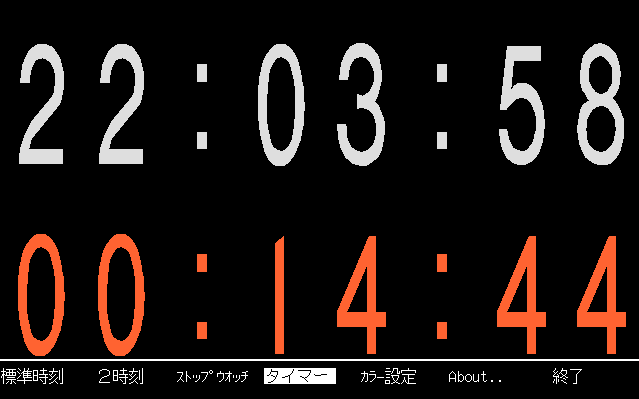

## DCLK：デジタル クロック for PC9801<!-- omit in toc -->

---
[Home](https://oasis3855.github.io/webpage/) > [Software](https://oasis3855.github.io/webpage/software/index.html) > [Software Download](https://oasis3855.github.io/webpage/software/software-download.html) > [dclk](../setkeytable/README.md) > ***dclk*** (this page)

<br />
<br />

Last Updated : Feb. 1993

- [ソフトウエアのダウンロード](#ソフトウエアのダウンロード)
- [機能の概要](#機能の概要)
  - [起動オプション](#起動オプション)
  - [使用例](#使用例)
- [動作環境](#動作環境)
- [バージョンアップ情報](#バージョンアップ情報)
- [主な掲載雑誌](#主な掲載雑誌)
- [ライセンス](#ライセンス)

<br />
<br />

## ソフトウエアのダウンロード

-    [このGitHubリポジトリを参照する](../dclk/download) 

-    [GoogleDriveを参照する](https://drive.google.com/drive/folders/0B7BSijZJ2TAHY2UzMWI5NDQtZWRjYi00MTdlLThlMGUtYmUwMDg2NGJkYmIy?resourcekey=0-0g55CdK32ZnItl6j99GNZA) 

<br />
<br />

## 機能の概要

このプログラムはPC-9801上で時計を表示するプログラムです 



滑らかなアウトラインフォントで画面いっぱいに時計を表示します（１文字の大きさは80×150ドット） 

１画面に最大２つの時計を表示可能。 デュアルタイム、ストップウォッチ、タイマーの機能あり

表示色は 4096 色より自由に選べます（イルミネーションモードではなめらかに表示色を変えて時計を表示） 

### 起動オプション

```
DCLK -[ﾊﾟﾗﾒｰﾀｰ]
```

パラメーター
```
書式             機能
----------------+-------------------------------------
-c##:##:##      | 時計表示の ｶﾗｰﾊﾟﾚｯﾄ の設定 Red:Green:Blue 順
                |       R:G:B はそれぞれ 0 ～ 15 をとります
-cb##:##:##     | ﾊﾞｯｸｸﾞﾗｳﾝﾄﾞ ｶﾗｰﾊﾟﾚｯﾄ の設定
-cs##:##:##     | ｽﾄｯﾌﾟｳｫｯﾁ の ｶﾗｰﾊﾟﾚｯﾄ の設定
-ct##:##:##     | ﾀｲﾏｰ の ｶﾗｰﾊﾟﾚｯﾄ の設定
                |
-k              | ｽｸﾘｰﾝ ｾｰﾊﾞｰ ﾓｰﾄﾞ
                |       ESC 以外のキーを押しても終了します
                |       メニュー表示はありません
                |
-d##:##         | ﾃﾞｭｱﾙ ﾀｲﾑ (第２時刻) 表示
                |       日本時刻との差をｎ時間ｎ分で示します
                |       例えばロンドンの時刻は（冬時間） -d-9:00 で
                |       す
                |
-i1             | ｲﾙﾐﾈｰｼｮﾝ ﾓｰﾄﾞ 1
                |       時刻表示色が変化します
-i2             | ｲﾙﾐﾈｰｼｮﾝ ﾓｰﾄﾞ 2
                |       ﾊﾞｯｸｸﾞﾗｳﾝﾄﾞ色が変化します
                |
-s              | ｽﾄｯﾌﾟｳｫｯﾁ
                |       この機能が開始したときよりの時分秒が表示され
                |       ます
-sn             | ｽﾄｯﾌﾟｳｫｯﾁ 秒表示ﾓｰﾄﾞ
                |
-t##:##         | ﾀｲﾏｰ ﾀﾞｲﾚｸﾄ指定
                |       ｎ時ｎ分にタイマーをセットします
-th##:##        | ﾀｲﾏｰ
                |       ｎ時間ｎ分後にタイマーをセットします
-tn####         | ﾀｲﾏｰ
                |       ｎ秒後にタイマーをセットします
                |
----------------+-------------------------------------

# は 数字をあらわします。
        時刻の時はそれぞれの時刻の範囲に従って下さい。
        例えば、１日は０時０分から２３時５９分等

タイマーの終了時には１５００Ｈｚのビープ音が５回鳴ります。
```

ｺﾏﾝﾄﾞﾗｲﾝ ﾊﾟﾗﾒｰﾀｰ の -k オプションを除いて ESC を押す事によって機能するメニュー中からも使用できます。

### 使用例

通常の時計表示
```
DCLK
```
１２分後にタイマーを設定
```
DCLK -th0:12
```
午前０時にタイマーを設定
```
DCLK -t0:0
```
日本時刻とｸﾞﾘﾆｯｼﾞ標準時を表示
```
DCLK -d-9:0
```
スクリーンセーバーとして時刻を表示（ｲﾙﾐﾈｰｼｮﾝ ﾓｰﾄﾞ1）
```
DCLK -k -i1
```

<br />
<br />

## 動作環境

- PC-9801 MS-DOS Ver 3.xx 以上
- 35 KByte 以上のフリーエリア
- 推奨機種
  - CPU が 80286 10MHz 以上の機種

<br />
<br />

## バージョンアップ情報

-  Version 1.0 (1993/02/28) 

<br />
<br />

## 主な掲載雑誌

- 特選MS-DOSスクリーンセーバ コレクションVol2 （インプレス） 
- ネットピア （学研） 
- Vector Pack （ベクター） 
- Vector History Pack （ベクター） 

<br />
<br />

## ライセンス

このソフトウエアは [GNU General Public License v3ライセンスで公開する](https://gpl.mhatta.org/gpl.ja.html) フリーソフトウエア
