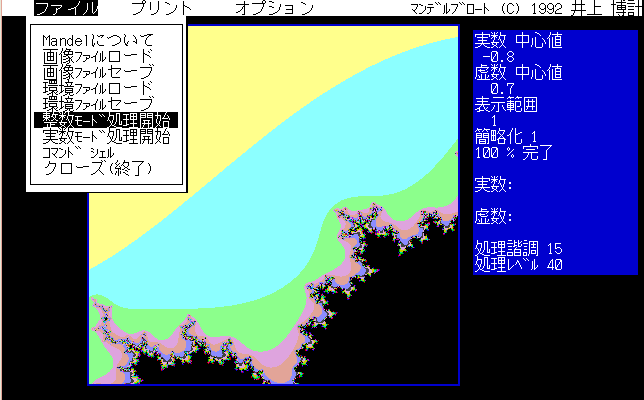

##  マンデルブロート集合作図 統合環境 for PC9801<!-- omit in toc -->

---
[Home](https://oasis3855.github.io/webpage/) > [Software](https://oasis3855.github.io/webpage/software/index.html) > [Software Download](https://oasis3855.github.io/webpage/software/software-download.html) > [setkeytable](../mandelbrot/README.md) > ***mandelbrot*** (this page)

 
 

Last Updated : Apr. 1992

- [ソフトウエアのダウンロード](#ソフトウエアのダウンロード)
- [機能の概要](#機能の概要)
  - [操作方法](#操作方法)
  - [計算方法の違いについて](#計算方法の違いについて)
  - [その他の項目のうち分かりにくい物について](#その他の項目のうち分かりにくい物について)
- [動作環境](#動作環境)
- [バージョンアップ情報](#バージョンアップ情報)
- [ライセンス](#ライセンス)

 
 

## ソフトウエアのダウンロード

-    [このGitHubリポジトリを参照する](../mandelbrot/download) 

-    [GoogleDriveを参照する](https://drive.google.com/drive/folders/0B7BSijZJ2TAHY2UzMWI5NDQtZWRjYi00MTdlLThlMGUtYmUwMDg2NGJkYmIy?resourcekey=0-0g55CdK32ZnItl6j99GNZA) 

 
 

## 機能の概要

このソフトウエアは、マンデルブロート集合を描画するものです。

マンデルブローと集合とは…
- Z := 0
- C := 複素平面上の任意の１点
- FOR(ｎ回) Z:= Z*Z + C  if(Z>ある値) break

このループがｎ回回ったらそれが条件を満たす点（マンデルブロート集合の１点）で有る。と言うような理論らしい！（よくわからんが．．．）

作者は、取りあえずＦＰＵが無くても速くすること　＆　統合環境（もどき）にすることを目標に２年前に制作し、暫く忘れ去っていた（取りあえず完成した）。ふとした事から、今回新たにバージョンアップする事にした。速度は様々な安全策を施したので少し遅くなった／使い勝手はだいぶ良くなった、と思う。

### 操作方法

基本的にはキーボード（主に矢印キー）を使用します。

メニューバーに入るには GRPH 又は F.10 キーを押します（TURBO C や Quick BASIC 等と同じ方法）。

メニューバーから下位のメニュー（ファイル／プリント／オプション）へ移るには矢印キー（↓）を押します。
下位のメニューが開いている状態では矢印キー（→←↑↓）を用いて任意のメニュー項目に移動できます。
メニューが選択（デフォルトでは反転）している状態でリターンキーを押すとさらなる下位メニュー又は其の機能が働きます。

入力ウインドウでは、矢印キーと全てのアルファベットキーが使えます。

全ての段階でＥＳＣ（エスケープ）キーは其の仕事を中断し、一つ前の段階に戻します。‘マウスによる中心指定’のみはマウスの左ボタンがリターンキーの代わりをします。ここでもＥＳＣキーは有効です。

TURBO C/C++ , BORLAND C++ , Quick C/BASIC , MS C/FORTRAN/BASIC , Microsoft Works , Macintosh の GUI 等をお使いの方にとっては簡単な操作（？）です。マウスで直接メニューを選択する事は出来ません。

### 計算方法の違いについて
‘整数モード’と‘実数モード’の違いは浮動小数点演算を使うかどうかです。ＦＰＵ（ＮＰＸ　８０ｘ８７）を積んだ機種は実数モードで動かした方が良いでしょう。整数モードとは固定小数点を用いた（long int）ものでＦＰＵが無
い機種ではこのモードがダントツに速いでしょう。

本文中では以下のように記述しています。

- 整数モード　＝　固定小数点計算　＝　ＤＳＰモード
- 実数モード　＝　浮動小数点計算　＝　Ｃモード

### その他の項目のうち分かりにくい物について

‘処理諧調’は使用するパレットの数です。ＰＣ－９８０１では１５諧調まで使えます。それ以上の数を指定すると、単なるカラーの繰り返しになります。

印刷時には、白黒で印刷されるので気にしなくていいでしょう。余り大きくするとメモリが足りなくなります。

‘計算レベル’は冒頭で説明した計算のループ回数ｎ回の事です。大きくするほど真の集合の解に近づきますが、時間もかかり、１６色をうまく配置しにくくなります。適当な値にして下さい。但し、処理諧調より大きな値を指定して
下さい。

‘環境ファイル（＊．ＥＮＶ）’とは、メニューの色や、スクリーンの色を指定したり、画像データファイル（＊．ＩＭＧ）やテンポラリーファイル（ＭＡＮＤＥＬ．ＴＭＰ　圧縮処理のために一時的に使用するファイル　高速なアクセスが要求される　ＲＡＭディスク等）の作成するドライブを指定します。

‘プレビュー’は印刷時の様式を画面上に再現する物です。
データファイルの圧縮は独自の方法を取っています。

 
 

## 動作環境

- PC-9801 MS-DOS 3.3x
- CPU が80286以上で4096色中16色が利用可能な機種
- メモリーのフリーエリア250kBytes以上
- 70kBytes以上フリーエリアのある高速なワークディスク（RAMディスク等）が必要です（画像セーブ時）。
- ESC/P又はPC-PR201系統のプリンタが必要です。

 
 

## バージョンアップ情報

-  Version 1.0 (1991/04/10) 

-  Version 2.0 (1992/03/20) 

-  Version 2.0 B (1992/04/06)
   -  MS-DOS Ver 5.00 の DOSSHELL のタスクスワップ(DOSSWAP)に対応
   -  計算途中でESCキー判定をキーテーブル参照からキーバッファ参照に変更（中断しやすい）
   -  ハードコピーの８色処理ルーチンをはずした。（少し高速化）
   -  実数計算部分をアセンブラ化。（手で最適化）最もよく使われる部分のみです

 
 

## ライセンス

このソフトウエアは [GNU General Public License v3ライセンスで公開する](https://gpl.mhatta.org/gpl.ja.html) フリーソフトウエア
